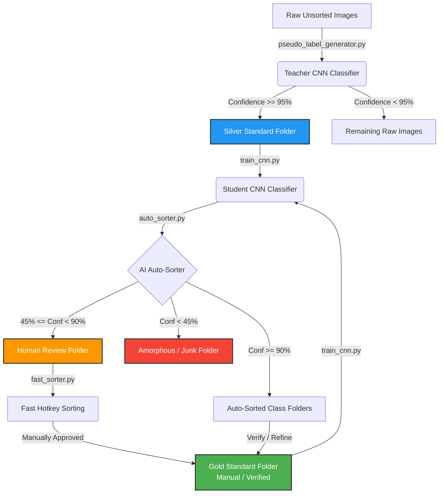

# Standalone CNN Toolkit: User Guide & Documentation

Welcome to the **Standalone CNN Toolkit**, a deep-learning-based image classification and data curation pipeline powered by PyTorch (ResNet-18) and Tkinter GUIs. This toolkit is designed to streamline the workflow of organizing, training, evaluating, and curating large-scale image datasets (specifically targeted at microscopic particles, diatoms, or similar objects).

---

## Table of Contents
1. [System Overview & Architecture](#1-system-overview--architecture)
2. [Prerequisites & Installation](#2-prerequisites--installation)
3. [Configuration Reference (`config.py`)](#3-configuration-reference-configpy)
4. [The Data Standards & Directory Layout](#4-the-data-standards--directory-layout)
5. [Script Walkthrough & Usage](#5-script-walkthrough--usage)
   - [A. Model Training (`train_cnn.py`)](#a-model-training-train_cnnpy)
   - [B. Generating Pseudo-Labels (`pseudo_label_generator.py`)](#b-generating-pseudo-labels-pseudo_label_generatorpy)
   - [C. Focused Fine-Tuning (`finetune_cnn.py`)](#c-focused-fine-tuning-finetune_cnnpy)
   - [D. Model Evaluation (`evaluate_cnn.py` & `eval_v5.py`)](#d-model-evaluation-evaluate_cnnpy--eval_v5py)
   - [E. AI-Automated Sorting GUI (`auto_sorter.py`)](#e-ai-automated-sorting-gui-auto_sorterpy)
   - [F. Lightning Manual Curation GUI (`fast_sorter.py`)](#f-lightning-manual-curation-gui-fast_sorterpy)
6. [Best Practices & Workflow Strategies](#6-best-practices--workflow-strategies)
7. [Troubleshooting & FAQs](#7-troubleshooting--faqs)

---

## 1. System Overview & Architecture

The toolkit combines **Active Learning**, **Teacher-Student Pseudo-Labeling**, and **Graphical Verification Tools** to minimize the manual effort needed to classify massive image datasets. 



### Core Components
- **Deep Learning Core**: A ResNet-18 architecture fine-tuned on custom datasets. PyTorch's pre-trained ImageNet weights are adapted to specific visual domains using customized fully connected layers.
- **Auto Sorter**: An AI GUI that automatically assigns class labels, routes uncertain images to a `Review` folder, and isolates highly low-confidence images into `Amorphous`.
- **Fast Sorter**: A custom-built manual validation interface optimized for lightning-fast curation using single-key keyboard bindings, undo logs, and progress persistence.

---

## 2. Prerequisites & Installation

To run this toolkit, ensure you have Python 3.8+ installed along with PyTorch, Torchvision, and Pillow.

### Installation Steps
1. Navigate to the toolkit directory:
   ```powershell
   cd \path\to\standalone_cnn_toolkit
   ```
2. Install the required dependencies:
   ```powershell
   pip install -r requirements.txt
   ```
   *Note: If you have a CUDA-supported GPU, ensure you install a CUDA-enabled PyTorch build for up to 10-20x faster training and inference speed.*

---

## 3. Configuration Reference (`config.py`)

All scripts in the toolkit dynamically read their settings from [config.py](standalone_cnn_toolkit/config.py). Modify this file to point to your directories and set hyperparameters.

### Configuration Variable Descriptions

| Parameter | Type | Default Value | Description |
| :--- | :--- | :--- | :--- |
| `TRAINING_DIRECTORIES` | List[str] | `[r"C:\path\to\GoldStandard", r"C:\path\to\SilverStandard"]` | Folder locations containing categorized training folders (used by training and fine-tuning). |
| `EVALUATION_DIR` | str | `r"C:\path\to\NewGoldStandard"` | The benchmark testing data folder containing subfolders for each true class. |
| `MODEL_SAVE_PATH` | str | `custom_diatom_resnet(ResNet-18 v5).pth` | Filename/path where trained model weights (`.pth`) are saved/loaded. |
| `CLASSES_SAVE_PATH` | str | `cnn_classes.json` | JSON file storing the class list in index order so the model can map numerical indices to class names. |
| `TRAINING_EPOCHS` | int | `40` | Number of times the AI studies the dataset in full training runs. |
| `REVIEW_CONFIDENCE_THRESHOLD`| float | `0.90` (90%) | Images classified with confidence below this threshold are routed to a human review folder. |
| `AMORPHOUS_THRESHOLD` | float | `0.45` (45%) | Images classified below this threshold are routed directly to the `Amorphous` category. |
| `FINETUNE_TARGET_CLASS` | str | `"Amorphous"` | Target class index given 5x representation boost during fine-tuning. |
| `FINETUNE_EPOCHS` | int | `5` | Number of epochs for the fine-tuning run. |
| `UNSORTED_RAW_DIR` | str | `r"C:\path\to\transfer"` | Directory containing massive amounts of raw, unsorted images for pseudo-labeling. |
| `SILVER_STANDARD_DIR` | str | `r"C:\path\to\SilverStandard"` | Destination directory where teacher pseudo-labels above the threshold will be placed. |
| `PSEUDO_LABEL_CONFIDENCE` | float | `0.95` (95%) | Minimum confidence required for a teacher model prediction to be auto-labeled. |
| `MAX_SAMPLES_PER_EPOCH` | int | `80000` | Sample capping threshold for processing massive datasets without slowing down training. |

---

## 4. The Data Standards & Directory Layout

To ensure scripts function properly, structure your image folders in a hierarchical class format:

```text
DatasetFolder/
├── CategoryA/
│   ├── image_001.png
│   └── image_002.jpg
├── CategoryB/
│   ├── image_003.png
│   └── image_004.jpeg
└── Amorphous/
    └── image_005.bmp
```

### The Three Standards of Data
1. **Gold Standard**: High-quality, human-curated ground truth dataset. Used for final benchmarking and core training.
2. **Silver Standard**: AI-generated labels that have passed high-confidence filters (e.g. >= 95% confidence). Excellent for scaling dataset size cheaply.
3. **Unsorted / Raw**: Incoming images directly from microscopes or cameras. Completely unlabeled.

---

## 5. Script Walkthrough & Usage

### A. Model Training (`train_cnn.py`)
Trains a fresh ResNet-18 model on all images located in `TRAINING_DIRECTORIES`. 

- **Key Logic**: 
  - Splits data 80% train / 20% validation.
  - Automatically loads pre-trained ImageNet weights (`ResNet18_Weights.DEFAULT`) and modifies the final fully-connected layers to match the number of classes.
  - Incorporates **Advanced Data Augmentation**: random vertical/horizontal flips, random 45-degree rotations, and color/brightness jittering (to simulate lighting fluctuations on micro-particles).
  - Implements **Epoch Capping**: caps the samples to 25,000 training images per epoch (with a randomized sampler) to prevent memory crashes and keep training times fast.
  - Saves the best model checkpoint based on **Macro-Averaged Validation Accuracy** to `MODEL_SAVE_PATH`.

- **Usage**:
  ```powershell
  python train_cnn.py
  ```

---

### B. Generating Pseudo-Labels (`pseudo_label_generator.py`)
Executes a teacher-student bootstrap process by reading raw images from `UNSORTED_RAW_DIR`, running inference using the teacher model (`resnet18_teacher.pth`), and saving predictions >= `PSEUDO_LABEL_CONFIDENCE` (95%) to `SILVER_STANDARD_DIR`.

> [!IMPORTANT]
> The teacher model file MUST be placed in the same directory as the script (i.e. `resnet18_teacher.pth` in the toolkit folder).

- **Usage**:
  ```powershell
  python pseudo_label_generator.py
  ```

---

### C. Focused Fine-Tuning (`finetune_cnn.py`)
Fine-tunes an existing, pre-trained model weights file (`MODEL_SAVE_PATH`) to focus specifically on a single problematic category (usually `Amorphous` or another underrepresented class).

- **Key Logic**:
  - Employs a **5x Weight Boost** for the target class inside PyTorch's `WeightedRandomSampler` to artificially increase its exposure in mini-batches.
  - Uses a **Micro Learning Rate** (1e-5 instead of the standard 1e-4 / 1e-3) to gently modify weights, preventing catastrophic forgetting of other classes.
  - Trains for a small number of epochs (`FINETUNE_EPOCHS`, default 5) to refine performance.

- **Usage**:
  ```powershell
  python finetune_cnn.py
  ```

---

### D. Model Evaluation (`evaluate_cnn.py` & `eval_v5.py`)
Evaluates the performance of the model checkpoint on the benchmark set specified by `EVALUATION_DIR`.

- **Key Logic**:
  - Matches the validation transformations of the training phase.
  - Applies a fallback classification threshold: if the prediction confidence is below `AMORPHOUS_THRESHOLD`, the image is automatically classified as "Amorphous".
  - Outputs the **Overall Accuracy** and a **Per-Class Accuracy breakdown**.
  - `eval_v5.py` is specialized for evaluating the v5 ResNet-18 model specifically (without dropout).

- **Usage**:
  ```powershell
  python evaluate_cnn.py
  python eval_v5.py
  ```

---

### E. AI-Automated Sorting GUI (`auto_sorter.py`)
An interactive Tkinter GUI that automates raw image sorting using the trained model weights. 

- **Key Features**:
  1. Interactive buttons to choose input unsorted directory and output destination directory.
  2. Multi-threaded background execution to keep the UI fluid.
  3. Visual progress bar showing elapsed time, current item speed, and ETA.
  4. Auto-thresholding logic:
     - **Confidence < `AMORPHOUS_THRESHOLD`** (default 45%): Routed to `Amorphous` subfolder.
     - **`AMORPHOUS_THRESHOLD` <= Confidence < `REVIEW_CONFIDENCE_THRESHOLD`** (default 90%): Routed to `Review` subfolder for human inspection.
     - **Confidence >= `REVIEW_CONFIDENCE_THRESHOLD`**: Placed directly in the predicted class subfolder.

- **Usage**:
  ```powershell
  python auto_sorter.py
  ```

---

### F. Lightning Manual Curation GUI (`fast_sorter.py`)
A keyboard-driven manual image viewer designed to review and sort images in record time.

- **Key Features**:
  - **Dynamic Keyboard Mappings**:
    - Keys `1` to `0`: Moves current image to Category 1 through 10.
    - `Shift` + `1` to `0`: Moves to Category 11 through 20.
    - `Ctrl` + `1` to `0`: Moves to Category 21 through 30.
    - Key `F` or `f`: Moves current image to a dedicated `Favorites` directory.
    - `Left` & `Right` Arrow Keys: Navigate between images.
    - `Ctrl` + `Z`: Instantly undoes the last image move (restores the file and updates the stack).
  - **Persistent Progress Tracking**: Automatically saves your current index in `fast_sorter_progress.json` for each directory, allowing you to close the app and resume sorting exactly where you left off.
  - **Dynamic Visual Flash**: Categories flash green in the legend when hotkeys are pressed to verify success.

- **Usage**:
  ```powershell
  python fast_sorter.py
  ```

---

## 6. Best Practices & Workflow Strategies

### Strategy 1: The Bootstrap Workflow (Starting from scratch)
1. Categorize a small subset (e.g., 200 images per class) using `fast_sorter.py` to create your initial **Gold Standard** directory.
2. Run `train_cnn.py` to train an initial model.
3. Run `pseudo_label_generator.py` on a large raw dataset using the initial model. Set `PSEUDO_LABEL_CONFIDENCE = 0.98` to guarantee high precision. This creates your **Silver Standard** directory.
4. Run a second training run with `config.py` pointing to both directories. You now have a high-capacity model trained on thousands of extra semi-supervised labels.

### Strategy 2: Iterative Refinement
1. Feed raw, unseen data into `auto_sorter.py`.
2. Open `fast_sorter.py` on the resulting `Review/` folder.
3. Rapidly re-classify mislabeled or uncertain images into their proper classes using hotkeys.
4. Move successfully validated images into your **Gold Standard** training directories to continuously improve the model's performance on edge cases.

---

## 7. Troubleshooting & FAQs

### Q: Why is the pseudo-label generator failing with "Model not found"?
**A**: Make sure the teacher weights are present at `resnet18_teacher.pth` (in the same directory as the script). If running the script from a subfolder, Python might not resolve the relative path. Ensure your terminal's working directory is correct.

### Q: Tkinter GUI displays empty images or throws PIL errors.
**A**: Ensure your directories contain only supported image extensions (`.png`, `.jpg`, `.jpeg`, `.tif`, `.tiff`, `.bmp`). Corrupted images are handled dynamically by the loaders, but extremely large images (e.g., raw panoramic scans) may crash memory limits.

### Q: Can I run this without a GPU?
**A**: Yes! PyTorch will automatically fall back to CPU if a CUDA device is unavailable. However, training will take significantly longer. It is highly recommended to run on a machine with a modern Nvidia GPU for smooth active learning workflows.

---

*For custom modifications or inquiries, refer to `config.py` comments or the source files.*
